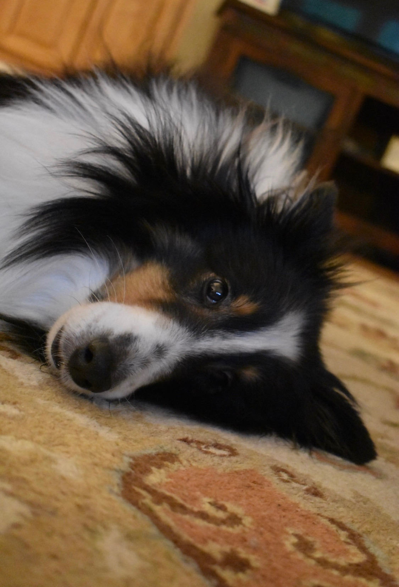

<h1>My Dogs</h1>

I have three dogs and they are all shelties. Their names are Izze, Sierra, and Hudson.

<h2>Izze</h2>

Some facts about Izze:

<ol>
  <li>Izze is the first child of all three dogs.</li> 
  <li>We got her in 2009 and she is now 11 years old.</li>
  <li>She's a tri sheltie which means she is black, white, and a little brown.</li>
  <li>She is named after the Pepsi drink "Izze" (pronouced "Izzy") because my dad works for Pepsi and people constantly think we're just spelling her name wrong.</li>
  <li>She's one of the most loving dogs you'll ever meet.</li>
  <li>She gives lots of kisses despite her bad breath.</li>
  <li>She used to run away all the time so we got a fenced in yard.</li>
</ol>

Here is a picture of her:

<h2>Sierra</h2>

Some facts about Sierra

<ol>
  <li>Sierra is the middle child of all three dogs.</li>
  <li>We got her in 2014 and she is now 6 years old.</li>
  <li>She's a blue merle sheltie which means she kind of looks like an Australian Shephard.</li>
  <li>She is named after the Pepsi drink "Sierra Mist".</li>
  <li>She definitely has undiagnosed anxiety because she's nervous all the time</li>
  <li>When she'd not anxious she loves to play with her brother and sister</li>
  <li>She's a really weird dog, but we love her any way</li>
<ol>

Here is a picture of her.

